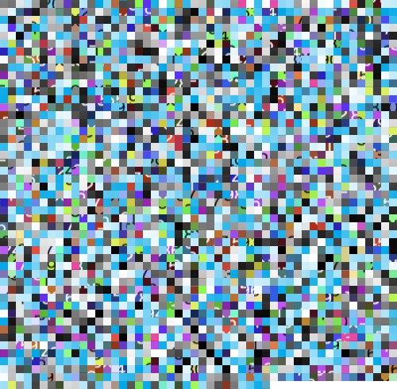
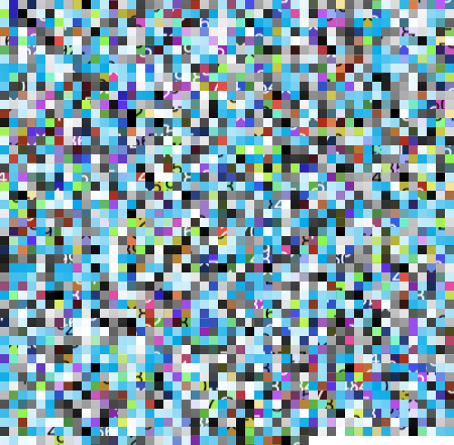
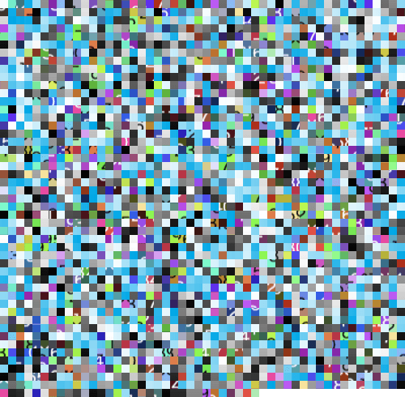
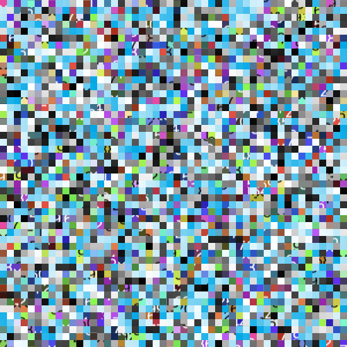
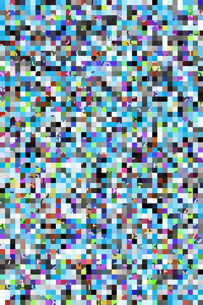
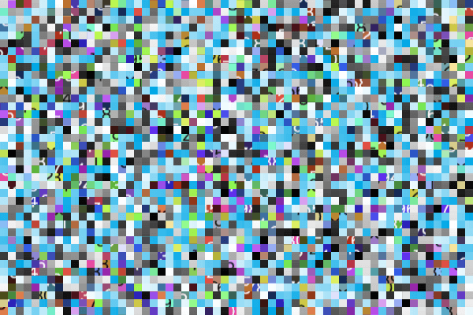

# [PoC] image-shield

This npm package provides functionality for image fragmentation and restoration.


## Installation

```
npm i image-shield
```

## Usage

```
import ImageShield from "image-shield";
```

`encrypt`

```ts
await ImageShield.encrypt({
  imagePaths: ["./input_0.png", "./input_1.png", "./input_2.png"],
  config: {
    blockSize: 32, // Smaller for security, larger for performance
    prefix: "img",
  },
  outputDir: "./output/fragments",
  secretKey: "secret",
});
```

`decrypt`

```ts
await ImageShield.decrypt({
  imagePaths: [
    "./output/fragments/img_0.png",
    "./output/fragments/img_1.png",
    "./output/fragments/img_2.png",
  ],
  manifestPath: "./output/fragments/manifest.json",
  outputDir: "./output/restored",
  secretKey: "secret",
});
```

## Encrypt

### Output: List by blockSize

| input | blockSize: 10 | blockSize: 32 | blockSize: 128 |
|:-------:|:---------------:|:---------------:|:----------------:|
|  |  |  |  |

### Output: Input Multiple images

blockSize: `32`

| input 1 | input 2 | input 3 |
|:-------:|:---------------:|:---------------:|
|  |  |  |

| output 1 | output 2 | output 3 |
|:-------:|:---------------:|:---------------:|
|  |  |  |

manifest.json:

```json
{
  "id": "614c69a2-b3c4-490b-a1d7-cb070aee1cfb",
  "version": "0.2.0",
  "timestamp": "2025-05-31T19:00:34.907Z",
  "config": {
    "blockSize": 32,
    "seed": 376768,
    "prefix": "img"
  },
  "images": [
    {
      "w": 500,
      "h": 500,
      "c": 4,
      "x": 16,
      "y": 16
    },
    {
      "w": 400,
      "h": 600,
      "c": 4,
      "x": 13,
      "y": 19
    },
    {
      "w": 600,
      "h": 400,
      "c": 4,
      "x": 19,
      "y": 13
    }
  ]
}
```

## Decrypt

### Error Output: Secret Key Mismatch

blockSize: `10`

| input 1 | input 2 | input 3 |
|:-------:|:---------------:|:---------------:|
|  |  |  |

| output 1 | output 2 | output 3 |
|:-------:|:---------------:|:---------------:|
|  |  |  |
