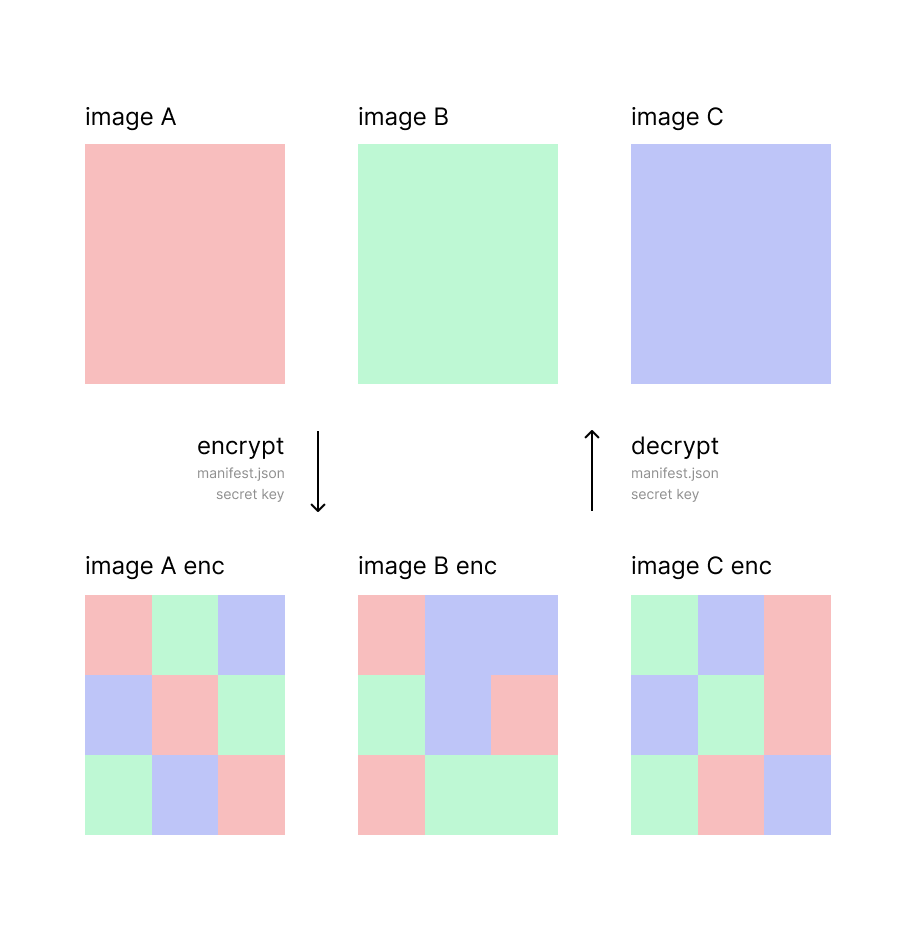
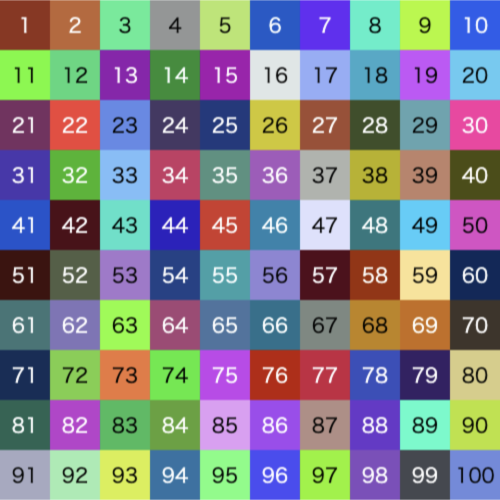
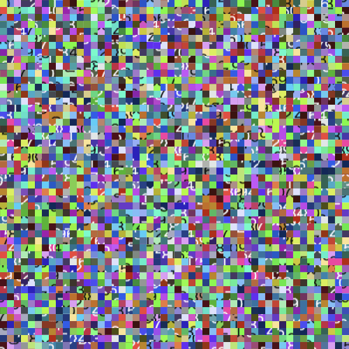
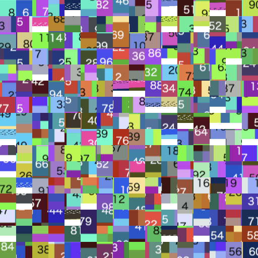
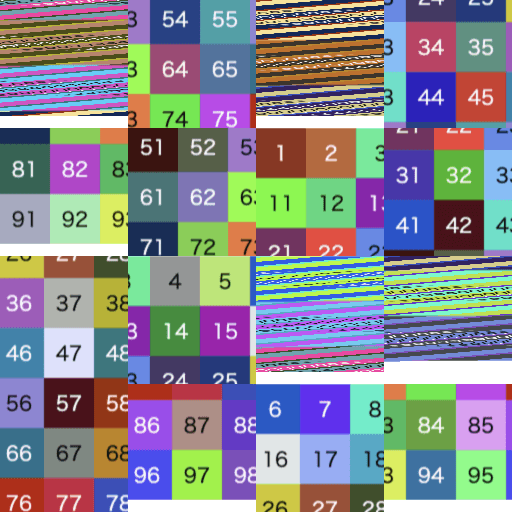
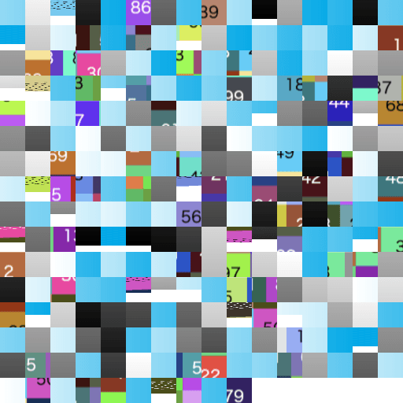
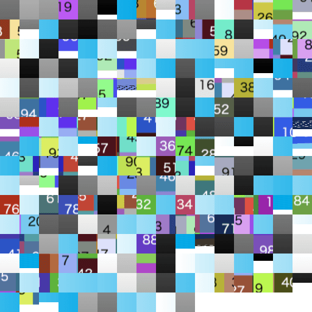
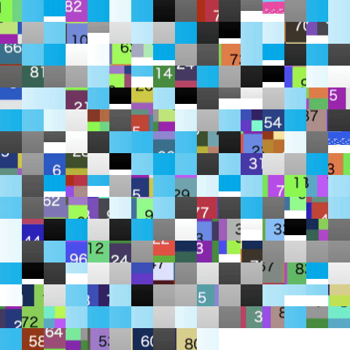

# image-shield



This npm package provides functionality for image fragmentation and restoration.

## Features

This package provides two main modes for image fragmentation:

- **Shuffle only**: If `secretKey` is not set, only shuffling is performed (no encryption).
- **Shuffle + Encrypt (recommended)**: If `secretKey` is set, both shuffling and encryption are performed.

---

## Installation

```
npm i image-shield
```

## Usage

### Shuffle only

If you do not set the `secretKey`, only shuffling will be applied to the image blocks.

**Encrypt**

```ts
await ImageShield.encrypt({
  imagePaths: [
    "./input_0.png",
    "./input_1.png",
    "./input_2.png"
  ],
  config: {
    blockSize: 32,
    prefix: "img",
  },
  outputDir: "./output/fragmented",
  // secretKey: undefined
});
```

<details>
<summary>Output:</summary>

```
output
└── fragmented
    ├── img_0.png
    ├── img_1.png
    ├── img_2.png
    └── manifest.json
```
</details>

**Decrypt**

```ts
await ImageShield.decrypt({
  imagePaths: [
    "./output/fragmented/img_0.png",
    "./output/fragmented/img_1.png",
    "./output/fragmented/img_2.png",
  ],
  manifestPath: "./output/fragmented/manifest.json",
  outputDir: "./output/restored",
  // secretKey: undefined
});
```

<details>
<summary>Output:</summary>

```
output
└── restored
    ├── img_0.png
    ├── img_1.png
    └── img_2.png
```
</details>

---

### Shuffle + Encrypt (recommended)

If you set the `secretKey`, the image blocks will be shuffled and then encrypted.

**Encrypt**

```ts
await ImageShield.encrypt({
  imagePaths: [
    "./input_0.png",
    "./input_1.png",
    "./input_2.png"
  ],
  config: {
    blockSize: 32,
    prefix: "img",
  },
  outputDir: "./output/fragmented",
  secretKey: "secret",
});
```

<details>
<summary>Output:</summary>

```
output
└── fragmented
    ├── img_0.png.enc
    ├── img_1.png.enc
    ├── img_2.png.enc
    └── manifest.json
```
</details>

**Decrypt**

```ts
await ImageShield.decrypt({
  imagePaths: [
    "./output/fragmented/img_0.png.enc",
    "./output/fragmented/img_1.png.enc",
    "./output/fragmented/img_2.png.enc"
  ],
  manifestPath: "./output/fragmented/manifest.json",
  outputDir: "./output/restored",
  secretKey: "secret",
});
```

<details>
<summary>Output:</summary>

```
output
└── restored
    ├── img_0.png
    ├── img_1.png
    └── img_2.png
```
</details>


## Shuffle Overview

### List by blockSize

| input | blockSize: 10 | blockSize: 32 | blockSize: 128 |
|:-------:|:---------------:|:---------------:|:----------------:|
|  |  |  |  |

### Input multiple images

blockSize: `32`

| input 1 | input 2 | input 3 |
|:-------:|:---------------:|:---------------:|
|  |  |  |

| output 1 | output 2 | output 3 |
|:-------:|:---------------:|:---------------:|
|  |  |  |


## Manifest Structure

manifest.json:

```json
{
  "id": "614c69a2-b3c4-490b-a1d7-cb070aee1cfb",
  "version": "0.4.0",
  "timestamp": "2025-05-31T19:00:34.907Z",
  "config": {
    "blockSize": 32,
    "seed": 376768,
    "prefix": "img"
  },
  "images": [
    {
      "w": 500,
      "h": 500,
      "c": 4,
      "x": 16,
      "y": 16
    },
    {
      "w": 400,
      "h": 600,
      "c": 4,
      "x": 13,
      "y": 19
    },
    {
      "w": 600,
      "h": 400,
      "c": 4,
      "x": 19,
      "y": 13
    }
  ],
  "secure": true
}
```

</details>

---

> [!NOTE]
> - The recommended mode is **Shuffle + Encrypt** for better security.
> - The `manifest.json` file contains the necessary information for restoration, but it does not include the secret key.