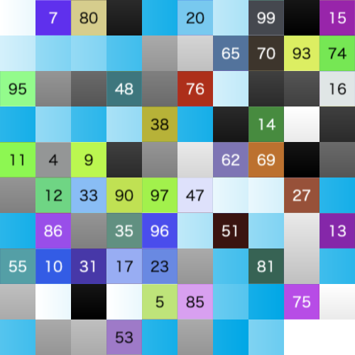

# image-shield


This npm package provides functionality for image fragmentation and restoration.

## Features

This package provides two main modes for image fragmentation:

- **Shuffle only**: If `secretKey` is not set, only shuffling is performed (no encryption).
- **Shuffle + Encrypt (recommended)**: If `secretKey` is set, both shuffling and encryption are performed.

---

## Installation

```
npm i image-shield
```

## Usage

```
import ImageShield from "image-shield";
```

### Shuffle only

If you do not set the `secretKey`, only shuffling will be applied to the image.

**Encrypt**

```ts
await ImageShield.encrypt({
  // config: { /** FragmentationConfig */ },
  imagePaths: [
    "./input_1.png",
    "./input_2.png",
    "./input_3.png",
  ],
  outputDir: "./output/fragmented",
  // secretKey: undefined
});
```

<details>
<summary>Output:</summary>

```
output
└── fragmented
    ├── img_1_fragmented.png
    ├── img_2_fragmented.png
    ├── img_3_fragmented.png
    └── manifest.json
```
</details>

**Decrypt**

```ts
await ImageShield.decrypt({
  manifestPath: "./output/fragmented/manifest.json",
  imagePaths: [
    "./output/fragmented/img_1_fragmented.png",
    "./output/fragmented/img_2_fragmented.png",
    "./output/fragmented/img_3_fragmented.png",
  ],
  outputDir: "./output/restored",
  // secretKey: undefined
});
```

<details>
<summary>Output:</summary>

```
output
└── restored
    ├── img_1.png
    ├── img_2.png
    └── img_3.png
```
</details>

---

### Shuffle + Encrypt (recommended)

If you set the `secretKey`, the image will be shuffled and then encrypted.

**Encrypt**

```ts
await ImageShield.encrypt({
  // config: { /** FragmentationConfig */ },
  imagePaths: [
    "./input_1.png",
    "./input_2.png",
    "./input_3.png",
  ],
  outputDir: "./output/fragmented",
  secretKey: "secret",
});
```

<details>
<summary>Output:</summary>

```
output
└── fragmented
    ├── img_1_fragmented.png
    ├── img_2_fragmented.png
    ├── img_3_fragmented.png
    └── manifest.json
```
</details>

**Decrypt**

```ts
await ImageShield.decrypt({
  manifestPath: "./output/fragmented/manifest.json",
  imagePaths: [
    "./output/fragmented/img_1_fragmented.png",
    "./output/fragmented/img_2_fragmented.png",
    "./output/fragmented/img_3_fragmented.png",
  ],
  outputDir: "./output/restored",
  secretKey: "secret",
});
```

<details>
<summary>Output:</summary>

```
output
└── restored
    ├── img_1.png
    ├── img_2.png
    └── img_3.png
```
</details>


## Shuffle Overview

### List by blockSize

| input | blockSize: 1 | blockSize: 2 | blockSize: 3 | blockSize: 4 |
|:-------:|:---------------:|:---------------:|:---------------:|:----------------:|
|  |  |  |  |  |

| blockSize: 8 | blockSize: 10 | blockSize: 16 | blockSize: 32 | blockSize: 128 |
|:-------:|:---------------:|:---------------:|:---------------:|:----------------:|
|  |  |  |  |  |

### Input multiple images

blockSize: `32`

| input 1 | input 2 | input 3 |
|:-------:|:---------------:|:---------------:|
|  |  |  |

| output 1 | output 2 | output 3 |
|:-------:|:---------------:|:---------------:|
|  |  |  |


## Manifest Structure

manifest.json:

```json
{
  "id": "7f2b2838-3f35-4ae8-a50b-154220ef3d7c",
  "version": "0.8.0",
  "timestamp": "2025-06-22T06:29:08.476Z",
  "config": {
    "blockSize": 2,
    "prefix": "img",
    "seed": 850367,
    "restoreFileName": false
  },
  "images": [
    {
      "w": 501,
      "h": 500,
      "c": 4,
      "x": 251,
      "y": 250
    },
    {
      "w": 490,
      "h": 490,
      "c": 4,
      "x": 245,
      "y": 245
    },
    {
      "w": 490,
      "h": 490,
      "c": 4,
      "x": 245,
      "y": 245
    },
    {
      "w": 887,
      "h": 887,
      "c": 4,
      "x": 444,
      "y": 444
    }
  ],
  "algorithm": "aes-256-cbc",
  "secure": true
}
```

</details>

---

> [!NOTE]
> - The recommended mode is **Shuffle + Encrypt** for better security.
> - The `manifest.json` file contains the necessary information for restoration, but it does not include the secret key.
> - Input images are converted to PNG format.

## Clients

- [Raycast Extension](https://github.com/tuki0918/raycast-image-shield)
