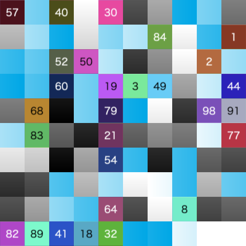

# [PoC] image-shield

This npm package provides functionality for image fragmentation and restoration.


## Installation

```
npm i image-shield
```

## Usage

```
import ImageShield from "image-shield";
```

`encrypt`

```ts
await ImageShield.encrypt({
  imagePaths: ["./input_0.png", "./input_1.png", "./input_2.png"],
  config: {
    blockSize: 32, // Smaller for security, larger for performance
    prefix: "img",
  },
  outputDir: "./output/fragments",
  secretKey: "secret",
});
```

`decrypt`

```ts
await ImageShield.decrypt({
  imagePaths: [
    "./output/fragments/img_0.png",
    "./output/fragments/img_1.png",
    "./output/fragments/img_2.png",
  ],
  manifestPath: "./output/fragments/manifest.json",
  outputDir: "./output/restored",
  secretKey: "secret",
});
```

## Output: blockSize

| input | blockSize: 10 | blockSize: 32 | blockSize: 128 |
|:-------:|:---------------:|:---------------:|:----------------:|
|  |  |  |  |

## Output: Multiple images

| input 1 | input 2 | input 3 |
|:-------:|:---------------:|:---------------:|
|  |  |  |

| output 1 | output 2 | output 3 |
|:-------:|:---------------:|:---------------:|
|  |  |  |
